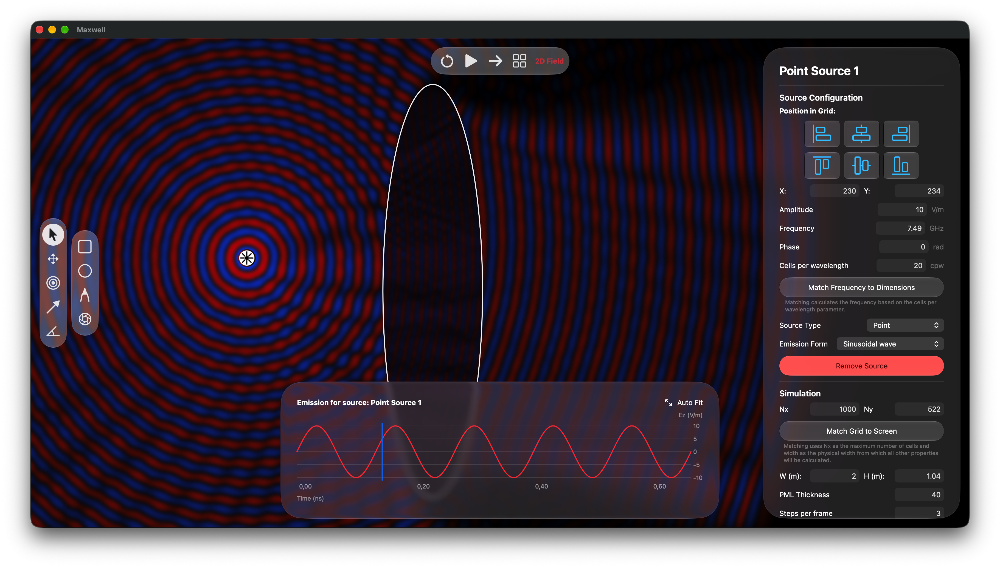
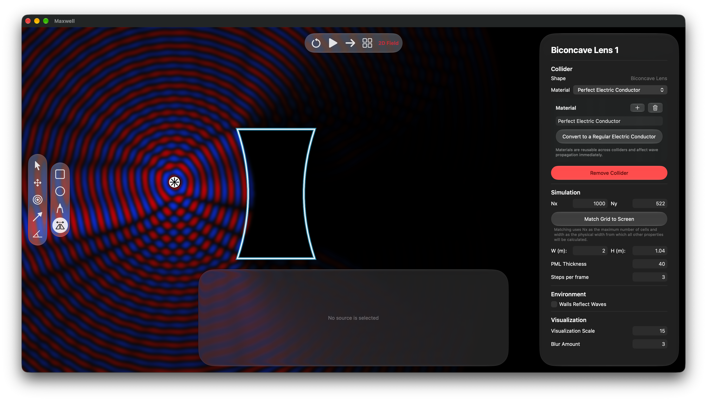
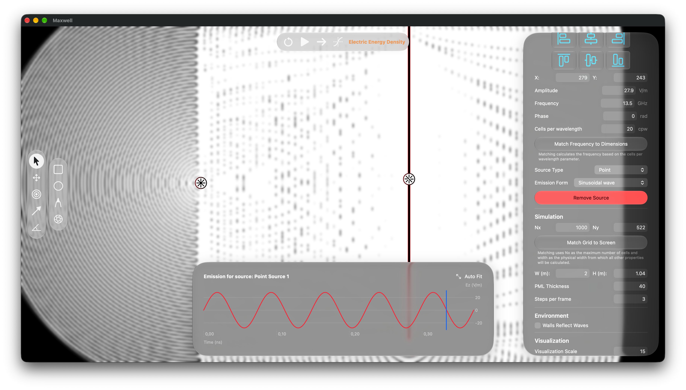
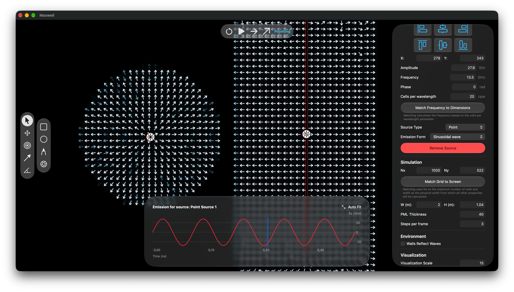

#  Maxwell
A FDTD simulator for electromagnetic fields.
## Features
- Real-time rendering in 7 visualization modes: (2D, 3D, Energy Glow, Energy Density, Magnetic Magnitude, Electric Magnitude and Poynting)
- Customizable sources that can be lines, points or gaussian beams with various emission forms (sine, pulse, gaussian-modulated sine, pure gaussian)
- Customizable Materials 
- Customizable Colliders for waves and materials and lenses
- Graphs for seeing emission of sources
- Visualization options

## Screenshots

